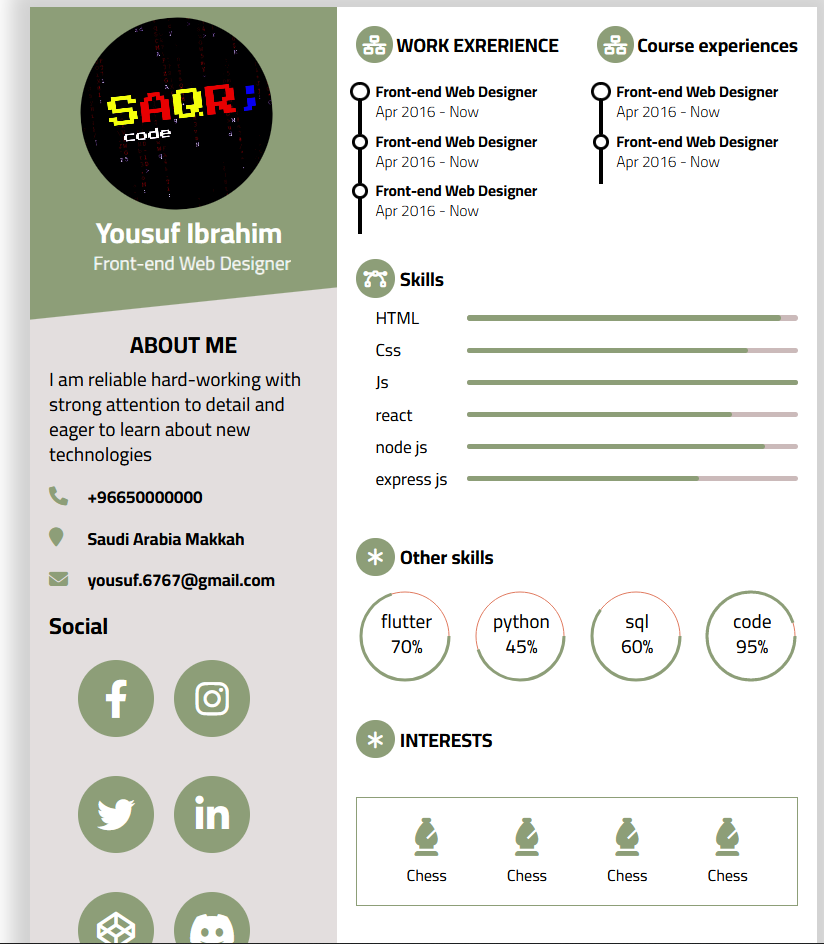

<!-- <<<<<<< HEAD
<div id="top"></div> -->
<!--
*** Thanks for checking out the Best-README-Template. If you have a suggestion
*** that would make this better, please fork the repo and create a pull request
*** or simply open an issue with the tag "enhancement".
*** Don't forget to give the project a star!
*** Thanks again! Now go create something AMAZING! :D
-->


<!-- PROJECT SHIELDS -->
<!--
*** I'm using markdown "reference style" links for readability.
*** Reference links are enclosed in brackets [ ] instead of parentheses ( ).
*** See the bottom of this document for the declaration of the reference variables
*** for contributors-url, forks-url, etc. This is an optional, concise syntax you may use.
*** https://www.markdownguide.org/basic-syntax/#reference-style-links
-->
<!-- [![Contributors][contributors-shield]][contributors-url]
[![Forks][forks-shield]][forks-url]
[![Stargazers][stars-shield]][stars-url]
[![Issues][issues-shield]][issues-url]
[![MIT License][license-shield]][license-url]
[![LinkedIn][linkedin-shield]][linkedin-url] -->


<!-- PROJECT LOGO -->
<br />
<div align="center">
  <a href="https://github.com/othneildrew/Best-README-Template">
    
  </a>

  <h1 align="center">template one</h1>

  <p align="center">
    قالب سيرة ذاتية يمكن تعبئته و رفعه على سيرفر
    <br />
    <a href="https://github.com/othneildrew/Best-README-Template"><strong>ملفات المشروع »</strong></a>
    <br />
    <br />
  </p>
</div>


<!-- TABLE OF CONTENTS -->
<details>
  <summary>في هذا القالب</summary>
  <ol>
    <li>
      <a href="#colors">الوان القالب</a>
    </li>
    <li>
      <a href="#dwonload">طريقة التحميل</a>
    </li>
    <li><a href="#usage">طريقة الاستخدام</a></li>
    <li><a href="#pic">صوره عن الشروع</a></li>
  </ol>
</details>


<!-- ABOUT THE PROJECT -->
## عن هذا المشروع


هذا المشروع يستخدم لصنع صفحه شخصية (سيرة ذاتية)
<br/>
من خلالها يمكن وضع بيناتك او التعديل عليها ثم رفها في استضافة
<br/>
دون تعب او خبرات عميلة في مجال الويب
<br/>
و كل ما تحتاج فهمه هو طريقة الاستخدام فقط


الممبزات:
<ol>
    <li>لا احتياج للخبرات العملية بالمرة</li>
    <li>لا احتياج لفهم الالوان او تنسيقاتها</li>
    <li>بيانات مرنة في الصفحة</li>
    <li>وضع اكثر من عنصر في الصفحه</li>
</ol>


<!-- GETTING STARTED -->
# الوان القالب <br id="colors"/>

الأخضر,
الابيض
#

# طريقة التحميل <br id="dwonload"/>
<ol>
    <li>في التيرمنال git تأكد من تحميل قيت هوب على جهازك من خلال كتابة</li>
    <li>انسخ رابط المستودع</li>
    <li>اختر مسار الملف الذي تريد اخذ القالب فيه</li>
    <li>ثم اكتب الامر الاتي في التيرمنال</li>
</ol>
```sh
clone --branch 1-template https://github.com/SaqrTeam/dynamic_resume_templates.git
```
<br/>
<br/>
<br/>


# طريقة الاستخدام <br id="usage"/>
<ol>
    <li>تأكد من تحميل النود جي اس في جهازك</li>
    <li>your_data.js ادخل على ملف ال</li>
    <li>إملاء البيانات التي تحتاجها</li>
    <li>html ثم اكتب الامر الاتي في التيرمنال لتحويل الصفحة الى ملف</li>
</ol>

# صورة للمشروع <br id="pic"/>




<!-- 


<!-- MARKDOWN LINKS & IMAGES 
<!-- https://www.markdownguide.org/basic-syntax/#reference-style-links 
[contributors-shield]: https://img.shields.io/github/contributors/othneildrew/Best-README-Template.svg?style=for-the-badge
[contributors-url]: https://github.com/othneildrew/Best-README-Template/graphs/contributors
[forks-shield]: https://img.shields.io/github/forks/othneildrew/Best-README-Template.svg?style=for-the-badge
[forks-url]: https://github.com/othneildrew/Best-README-Template/network/members
[stars-shield]: https://img.shields.io/github/stars/othneildrew/Best-README-Template.svg?style=for-the-badge
[stars-url]: https://github.com/othneildrew/Best-README-Template/stargazers
[issues-shield]: https://img.shields.io/github/issues/othneildrew/Best-README-Template.svg?style=for-the-badge
[issues-url]: https://github.com/othneildrew/Best-README-Template/issues
[license-shield]: https://img.shields.io/github/license/othneildrew/Best-README-Template.svg?style=for-the-badge
[license-url]: https://github.com/othneildrew/Best-README-Template/blob/master/LICENSE.txt
[linkedin-shield]: https://img.shields.io/badge/-LinkedIn-black.svg?style=for-the-badge&logo=linkedin&colorB=555
[linkedin-url]: https://linkedin.com/in/othneildrew
[product-screenshot]: images/screenshot.png -->
